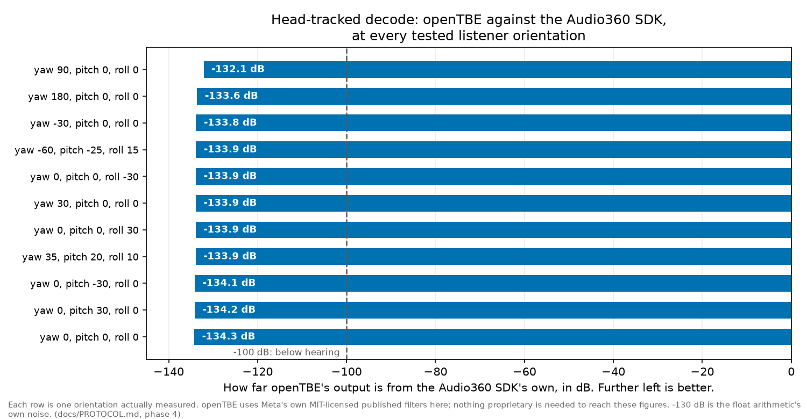

[]() [](#how-accurate-is-it) []() []() [](docs/upstream/) [](./LICENSE)

# openTBE

**An open, native encoder and renderer for TBE, the 8-channel spatial audio
format of the Facebook 360 Spatial Workstation.**

openTBE takes ambisonic audio in, produces TBE, packages it into the FB360
delivery formats, and renders it back to binaural with head tracking. It is
plain Python, and it needs nothing proprietary: no Rosetta, no Audio360
library, no GUI.

It reproduces the original Audio360 SDK's own decode to about **-134 dB**,
the floating-point arithmetic's own noise floor, using filter coefficients
Meta published under the MIT licence.



## Why this exists

The FB360 Spatial Workstation is discontinued. Its Audio360 SDK is x86-only
and survives on modern Macs solely through Rosetta, its Encoder is a
GUI-driven Intel binary, and Meta distributes neither any more. Anyone
holding TBE material, or running a pipeline that has to process it, is one
OS release away from being unable to open it.

openTBE removes that dependency. Rather than guessing at what the original
tools did, it measured them: the Audio360 SDK for decoding, the FB360
Encoder for encoding. Every number here came out of those measurements, and
the scripts that produce them are in this repository.

It grew out of
**[immersive-formats-evaluation](https://github.com/mormegil6/immersive-formats-evaluation)**
([GitLab](https://git.pg.edu.pl/p829296/immersive-formats-evaluation)), a
benchmarking study of immersive audio formats. That study needed to render
TBE without a DAW, so it built a headless harness around the SDK
([`pipeline/tbe/`](https://github.com/mormegil6/immersive-formats-evaluation/tree/main/pipeline/tbe),
built 2026-07-28/29). openTBE uses that harness as its reference oracle and
goes one step further: characterise what the binary does, then reimplement
it natively so the binary can be retired.

## Quick start

```bash
git clone https://github.com/mormegil6/opentbe.git
cd opentbe
python3 -m venv venv && source venv/bin/activate
pip install numpy scipy soundfile matplotlib

# Build the filter set. Needs nothing else, takes seconds.
python tools/get_mit_filters.py
```

Then, whichever direction you need:

```bash
# Encode: ambisonic master -> TBE
python tools/ambix_to_tbe.py master_ambix.wav out_tbe8.wav

# Package like the old Encoder did (video required, head-locked stereo optional)
python tools/fb360_package.py out_tbe8.wav video.mp4 out.mkv \
       --headlocked narration.wav

# Open an existing FB360 file and render it to binaural
python tools/fb360_ingest.py old_fb360.mp4 tbe8.wav --binaural out.wav

# Render TBE to binaural, fixed head or head-tracked
python tools/render_native.py in_tbe8.wav out_binaural.wav
python tools/render_trajectory.py in_tbe8.wav trajectory.txt out.wav
```

That is the whole tool. Everything below is how well it matches the
original, and how to check that yourself.

## How accurate is it?

Accuracy here always means **how far openTBE's output is from what the
original software produced from the same input**, in dB, more negative being
better. Around -100 dB the difference is a hundred-thousandth of the signal,
far below hearing. Around -130 dB it is the arithmetic's own rounding noise.

| What | Measured against | Result |
|---|---|---|
| Encode matrix, first-order gains | FB360 Encoder | exact to 7 significant figures |
| Encode matrix, second-order gains | FB360 Encoder | about 3 significant figures (no lossless path exists) |
| Encode, whole file | FB360 Encoder | indistinguishable from the delivery codec's own floor |
| Fixed-head decode | Audio360 SDK | -134 dB on programme-like material |
| Head-tracked decode | Audio360 SDK | -132 to -134 dB across 11 orientations |
| Orientation changing over time | Audio360 SDK | -114 to -132 dB across 5 cases |

Every one of those uses only the filters this repository ships. Nothing
proprietary is needed to reach them.

### One filter set, and why that was not always obvious

Meta open-sourced two sets of binaural coefficients in
[facebookarchive/Audio360](https://github.com/facebookarchive/Audio360):
`AmbiBinauralCoefficients2OA.cpp` and `AmbiBinauralCoefficients3OA.cpp`.
TBE is a second-order format, so 2OA looks like the obvious choice. It is
the wrong one: the engine decodes TBE through the third-order path.

openTBE used 2OA at first, and spent a long time writing up the resulting
mismatch as evidence that the SDK carried privately revised filters. It did
not. Both files are snapshotted in [`docs/upstream/`](docs/upstream/), and
the declared tap counts settle it before any audio is compared:

| | per-harmonic tap counts |
|---|---|
| 2OA declares | 180, 184, 181, 77, **80**, 179, 183, 84, 185 |
| 3OA declares | 180, 183, 182, 77, **73**, 179, 183, 84, 185 |
| measured from the SDK | 180, 183, 182, 77, **73**, 179, 183, 84, 185 |

Per-channel residuals move from -8 to -38 dB against 2OA, to -136 to -149 dB
against 3OA. All nine 3OA arrays also appear byte-for-byte inside
`libAudio360.dylib`. The full account, including what the wrong file cost
and why the wrong conclusion looked reasonable at the time, is in
[docs/PROTOCOL.md](docs/PROTOCOL.md).

## What openTBE covers

The Spatial Workstation was two tools: an Encoder that turned ambisonic
masters into TBE and packaged them for delivery, and a renderer that turned
TBE back into binaural. openTBE covers both.

```
   ambisonic master (ambiX, 2nd order or higher)
        |
        |  ambix_to_tbe.py          encode matrix measured against the
        v                           real FB360 Encoder
   TBE, 8 channels  (+ optional head-locked stereo)
        |
        |  fb360_package.py         mp4 and mkv delivery, metadata layout
        v                           matched to the Encoder's own output
   FB360 mp4 / mkv
        |
        |  fb360_ingest.py          reads either variant back
        v
   TBE, 8 channels
        |
        |  render_native.py         fixed head
        |  render_trajectory.py     head-tracked, orientation over time
        v                           both measured against the Audio360 SDK
   binaural stereo
```

A note on names, because the Encoder does not say "TBE": its menus and CLI
say **HHOA**, for *Hybrid Higher-Order Ambisonics*, which its own help text
defines as "the Spatial Workstation 8-channel format". Same thing. "Hybrid"
because those 8 channels are a complete first order plus 4 of the 5
second-order components, so the set sits between orders. The one left out is
ACN 6, which rotation still feeds under pitch and roll; Meta's 3OA set
publishes it, which is why head tracking works here without any measurement.

Against the Encoder's real format menus, its CLI names in brackets:

| Encoder feature | openTBE |
|---|---|
| ambiX 2nd/3rd order in `[ambix-second, ambix-third]` | yes, gains measured against the Encoder |
| TBE in, which it calls HHOA `[hhoa]` | yes, native throughout |
| `.tbe` audio conversion | yes, as an 8-channel wav |
| Facebook 360 video mp4 `[fb360-hhoa]` | yes, verified against a real Encoder-produced file |
| FB360 Matroska `[mkv-360]` | yes, though the channel order could not be confirmed, see below |
| Head-locked stereo bed | yes, on packaging, ingest, and the head-tracked render path |
| Binaural render, fixed and head-tracked | yes, and beyond the Encoder: that was the SDK's job |
| 1st-order ambiX in `[ambix-first]` | yes, the second-order channels come out silent |
| FuMa in/out `[fuma-first, fuma-second]` | no |
| Quad-binaural output | no, and it is GUI-only in the Encoder anyway |
| YouTube / Oculus / 180 variants | no |
| Focus (`--focus-size-deg`) | no, and not characterised |

**Known gaps**, stated because the point of this project is that its claims
can be checked: FuMa conversion and quad-binaural are not implemented, the
Encoder's focus feature was never measured, and no original
Encoder-produced mkv survived for a byte comparison, so the mkv channel
order rests on the mp4 track layout plus the Encoder's own metadata rather
than a direct check. If you have an untouched FB360 mkv from the era, that
is the single most useful thing anyone could contribute.

## Checking any of this yourself

**[docs/REPRODUCING.md](docs/REPRODUCING.md)** is the full method: what
reproduces with no proprietary software at all, and what needs the archived
SDK and Encoder, including where those can still be obtained, how to build
the helper binaries, one command per measurement, and what each should
print.

`python tools/get_sdk_filters.py` walks the SDK-side prerequisites in order,
stops at the first thing missing, and prints the command or link that fixes
it. Since the 3OA correction it is a verification path rather than a
requirement: you do not need it for an accurate decode.

### The figures

[`tools/plot_validation.py`](tools/plot_validation.py) draws these from the
measurement runs, and they are committed so the evidence is visible without
running anything:

- **[`orientation_grid.png`](figures/orientation_grid.png)** - the figure
  above: head-tracked accuracy at every tested orientation.
- **[`phase2_residuals.png`](figures/phase2_residuals.png)** - fixed-head
  decode per test signal, plus a spectrogram of what is left over.
- **[`phase5_trajectory_residuals.png`](figures/phase5_trajectory_residuals.png)** -
  orientation changing over time, five cases, each against its own threshold.
- **[`filter_comparison.png`](figures/filter_comparison.png)** - the shipped
  filters, magnitude and phase per channel.

### Provenance, and what is not published

The filters openTBE ships are generated directly from
[Meta's MIT-licensed coefficients](docs/upstream/audio360-mit/), snapshotted
here in case the upstream archive disappears. Measurements taken from the
proprietary SDK are never published: `data/` and `figures/local/` are
gitignored, and
[docs/REPRODUCING.md](docs/REPRODUCING.md#seeing-what-this-repo-does-not-publish)
lists every withheld artefact with the command that regenerates it.

Since the 3OA correction this matters less than it did. The measurements no
longer contribute to accuracy at all; they are an independent cross-check of
a result that stands without them. Reasoning in
[docs/PLAN.md](docs/PLAN.md). Not legal advice.

## Status

Working end to end: encode, package, ingest, fixed-head and head-tracked
decode. Phases 0 to 7 of [docs/PLAN.md](docs/PLAN.md) are done, each
measured against the original tool and derived in
[docs/PROTOCOL.md](docs/PROTOCOL.md). The reverse engineering is complete;
what remains is engineering.

## Future work

- **A realtime player.** The decode and the transition behaviour are fully
  characterised, so this is now an engineering task rather than a research
  one: streaming input, partitioned convolution, audio output, and live
  orientation over OSC. That last part already exists in the sibling
  [Busola](https://github.com/mormegil6/busola) project, a macOS menu-bar app
  whose head-tracker bridges (openNx for the Waves Nx, openMMRL for the
  MetaMotion RL) were merged into it. Not started; contributions welcome.
- **44.1 kHz filter sets.** Meta's release includes them; everything here
  was captured and validated at 48 kHz.
- **An original Encoder-produced mkv**, to confirm the channel order
  directly.
- **FuMa conversion and quad-binaural**, the two real coverage gaps against
  the Encoder.

## Credits and sources

- **[immersive-formats-evaluation](https://github.com/mormegil6/immersive-formats-evaluation)**
  ([GitLab](https://git.pg.edu.pl/p829296/immersive-formats-evaluation)) -
  the benchmarking study this repository grew out of. Its
  [`pipeline/tbe/`](https://github.com/mormegil6/immersive-formats-evaluation/tree/main/pipeline/tbe)
  holds the headless SDK harness openTBE uses as its decode oracle, and
  documents how to obtain the SDK.
- **[facebookarchive/Audio360](https://github.com/facebookarchive/Audio360)** -
  Meta's own open-sourced Ambisonics-to-binaural renderer and coefficients,
  MIT licensed. The filters openTBE ships derive from its
  `AmbiBinauralCoefficients3OA.cpp`, and the decoder algorithm from its
  `AmbiSphericalConvolution.cpp`. Both snapshotted in
  [docs/upstream/audio360-mit/](docs/upstream/audio360-mit/).
- **Angelo Farina** - his
  ["Ambisonics to TBE conversion"](https://www.angelofarina.it/TBE-conversion-new.htm)
  page is the only public documentation this format's channel layout has,
  and is the source of the mapping and signs used here; the measurement
  confirms his table, with one small correction noted in
  [docs/PROTOCOL.md](docs/PROTOCOL.md). His server is also the only
  surviving public source of the FB360 software and its SDK. Because it is a
  personal academic page with no maintainer since his death, both have been
  archived:
  - FB360 installers:
    [index](https://web.archive.org/web/20260511153757/https://angelofarina.it/Public/FB360/),
    [Mac](https://web.archive.org/web/20260729102037/https://angelofarina.it/Public/FB360/Mac-new-2023/),
    [Windows](https://web.archive.org/web/20260729102634/https://angelofarina.it/Public/FB360/Win/),
    [older Mac](https://web.archive.org/web/20260729103004/https://angelofarina.it/Public/FB360/Mac-old/)
  - Audio360 SDK:
    [index](https://web.archive.org/web/20260815073925/https://www.angelofarina.it/Public/Facebook-Spatial-Workstation/Download/SDK/),
    [1.7.12](https://web.archive.org/web/20260815073938/https://www.angelofarina.it/Public/Facebook-Spatial-Workstation/Download/SDK/Audio360_SDK_1.7.12-cd52f5f44271.zip),
    [1.3.0](https://web.archive.org/web/20260815073950/https://www.angelofarina.it/Public/Facebook-Spatial-Workstation/Download/SDK/Audio360_SDK_1.3.0.zip),
    first captured 2026-08-15 at this project's request

## License

MIT. See [LICENSE](LICENSE). An independent reimplementation for
interoperability and preservation; not affiliated with or endorsed by Meta
Platforms, Inc. [`docs/upstream/`](docs/upstream/) preserves third-party
material under its own original notices rather than under this repository's
licence; see [docs/upstream/README.md](docs/upstream/README.md).

## Contact

Bartłomiej Mróz · bartlomiej.mroz@pg.edu.pl · Department of Multimedia Systems, Gdańsk University of Technology · [bmroz.eu](https://bmroz.eu)
